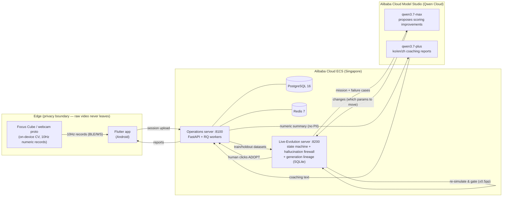

# Concentration Cube — a Self-Evolving Focus Agent on Qwen Cloud

Parents and teachers keep asking the same question — *is this student actually focusing, or just sitting at the desk?* A camera can answer it, but nobody wants a camera streaming a child's face to somebody else's cloud. Concentration Cube resolves that tension by moving the computer vision to the device: raw video is never stored and never transmitted. A desk-side camera runs on-device CV and emits only numeric records at 10 Hz — gaze, blink, PERCLOS, pupil z-scores — so a 20–40 minute session reaches the cloud as roughly 12,000–24,000 rows of numbers and nothing else. From those numbers the server computes a **Sustained Focus Index (SFI, 0–100)**. The cloud sees numbers, never faces.

On top of that measurement pipeline sits the part we care about most: a **self-evolution engine** in which Qwen proposes improvements to the scoring parameters, and every proposal must survive a clinical-style validation gate before a human is allowed to adopt it.

## The two-server design: the product, and the engine that grows it

Concentration Cube is deliberately split into two servers. The **operations server** is the product — it talks to devices, scores sessions, serves reports to the app. The **evolution server** exists for one purpose only: to make the operations server better. It owns the mistake logs, the generation lineage, the Qwen proposer, and the validation gates, and nothing it produces reaches production except a fully gated parameter set that a human explicitly adopts. The growth engine is a separate system from the thing that grows — so the product stays simple and auditable while the engine iterates on it, generation after generation, with human judgment required only at the final adoption click.

## Where the evidence comes from

The ground truth that drives evolution is not scraped and not opinion. Our team runs an **IRB-approved validation program at a general hospital**, collecting supervised, consented labeled sessions on an ongoing basis — confronting the ethics and safety questions of measuring children's attention head-on rather than around. Every day of collected ground truth becomes fresh evidence for the next generation: a new chance for the engine to be wrong, be caught by the gate, or genuinely improve. Consumers only ever meet the cube; behind it, this daily loop is what the evolution server feeds on.

(For this repository and the public cloud demo, a synthetic seeding tool stands in for clinical data — see `server/local/tools/seed_demo_sessions.py`.)

## An Alibaba-native ecosystem

The hardware, the cloud, and the intelligence live under one roof. The cube is sourced for manufacturing through **Accio, Alibaba's AI sourcing platform**, with PCBA suppliers from the Alibaba ecosystem; the backend runs on **Alibaba Cloud ECS**; the models are **Qwen on Model Studio**. And the AI is not a feature bolted onto the product — it is the background force that evolves the product's own server.

## Why this is a MemoryAgent

The agent's memory is not a chat log. It is a **versioned lineage of validated scoring parameters, together with the evidence that justified each generation.**

Every generation records what the model diagnosed, which parameters it changed, the train/holdout numbers the server independently recomputed, and whether a human adopted or dismissed it. Generation *N+1* is proposed against the accumulated failure history of everything before it — the confusion matrix, the mistake log, the bounds that previous generations proved unsafe. Experience compounds as evidence rather than as recalled text, and because each entry carries its own measured outcome, the lineage is auditable: you can point at any adopted parameter set and retrieve the numbers that earned its adoption.

## Architecture



## How Qwen Cloud is used

Two Qwen models run in two distinct roles, both through **Alibaba Cloud Model Studio (Singapore, `ap-southeast-1`)** over its OpenAI-compatible `/chat/completions` endpoint. Splitting roles across models also splits the per-model free token quota.

| Model | Role | Runs in | Source file |
|---|---|---|---|
| `qwen3.7-max` | Proposer — reads the failure evidence and decides which scoring parameters to move | Evolution server | [`live-evolution-server/local/app/agents/qwen_api.py`](live-evolution-server/local/app/agents/qwen_api.py) |
| `qwen3.7-plus` | Coach — writes trilingual (ko/en/zh) student and parent reports from a numeric summary | Operations server | [`server/local/app/jobs/llm_report.py`](server/local/app/jobs/llm_report.py) |

Those two files are the **proof of Alibaba Cloud usage** — they contain the actual HTTP calls. Model selection is environment-driven (`QWEN_EVOLVE_MODEL` / `QWEN_COACH_MODEL`, see [`deploy/alibaba/.env.cloud.example`](deploy/alibaba/.env.cloud.example)); the values above are what the deployed ECS stack runs.

The coaching call is deliberately narrow: `build_numeric_summary()` in `llm_report.py` strips everything but aggregate numbers before the request leaves the server, so no raw records and no identifying information are sent to the model. If the coaching call fails, scoring is unaffected — the LLM report is a separate column, never an input to the score.

## The hallucination firewall

The central engineering idea is that **the LLM is never trusted for a number.** It is trusted only for a judgment call: *which* parameters are worth moving, and in which direction.

Everything downstream is deterministic server code:

1. **The server computes the numbers, not the model.** `qwen_api.py` gives the model no file, tool, or network access — the evidence is inlined into one prompt and a single JSON object comes back. The server then runs the same simulation core (`classify_core.eval_train_lite`) itself to produce `train_before` and `train_after`, and assembles `proposal.v1` with `self_test_source: "server_recompute"`. Claimed metrics from the model are discarded before they can enter the record.
2. **Any deviation beyond 0.5 percentage points is fatal.** [`app/loop/validate.py`](live-evolution-server/local/app/loop/validate.py) re-runs `simulate(new_params)` and compares against the proposal's self-test at `RECOMPUTE_TOL = 0.005`. A mismatch is treated as hallucination or fabrication and the proposal is rejected outright. The same validator enforces the structural contract: no hidden changes, no new keys, no type changes, every value inside declared bounds, at most 8 changed keys, `sfi_weights` summing to exactly 100.
3. **Then a train/holdout gate measures real generalization.** Passing the recomputation check only proves the model reported honestly about the training split. The proposal is registered as a candidate parameter set and evaluated against a held-out split by the operations server; the state machine in [`app/loop/machine.py`](live-evolution-server/local/app/loop/machine.py) walks it through `COLLECT → PROPOSE → REVIEW_DIFF → REGISTERED → EVALUATING → PASSED | REJECTED | FAILED`.
4. **Then a human clicks adopt.** `PASSED` is a recommendation, not a deployment. Adoption is an explicit human action (`mark_adopted`), and every adopted set can be rolled back.

The practical consequence: a model that confidently reports an improvement it did not achieve cannot get past step 2, and a model that genuinely improves the training split but overfits cannot get past step 3.

## A measured generation

Not a design sketch — this is the first generation driven by Qwen end to end, against a live deployment. We seeded synthetic LAB-5 sessions engineered so that blank staring falls just outside the current dispersion threshold and is therefore misread as focus, then ran one generation. Total elapsed time from `COLLECT` to `PASSED`: **2 minutes 10 seconds.**

`qwen3.7-max` proposed two changes:

```json
[{"key": "blank_stare.stare_dispersion_th",   "from": 0.035, "to": 0.055},
 {"key": "blank_stare.max_saccade_count_1s",  "from": 0.5,   "to": 0.6}]
```

Holdout results — five sessions the proposal never influenced:

| State | Sensitivity | Specificity |
|---|---|---|
| **blank_stare** | **0.273 → 1.000** | 1.000 → 1.000 |
| **focus** | 1.000 → 1.000 | **0.619 → 1.000** |
| off_task | 1.000 → 1.000 | 1.000 → 1.000 |

No metric regressed, so the gate passed. The validator recorded `stage: 4, warnings: []` — the recomputation check found the server's own numbers and the proposal's self-test in agreement.

The detail worth reading twice is in the model's stated reasoning for the first change:

> *"…a value distinct from the previously rejected 0.06 / 0.062, to distribute holdout overfitting risk."*

An earlier generation had proposed 0.06 and had it rejected. That outcome is in the lineage, the lineage is in the evidence, and the model used it — choosing a different point in the separation gap specifically to avoid repeating a recorded failure. Nothing in the prompt instructs it to consult past rejections. This is what we mean by memory as evidence: the agent's history changed what it proposed next.

## Built during the submission period

The project started on June 12, 2026 — inside the submission window — so everything in this repository was built during it. The final week added the pieces this hackathon is about:

1. **The evolution engine's brain moved onto Qwen.** Proposals previously came from local CLI coding agents driven as subprocesses, which required interactive OAuth on the host machine and therefore could not run on a server. The `QwenApiAdapter` (`app/agents/qwen_api.py`) reaches Qwen over the Model Studio HTTP API with a key instead — which is what made the engine cloud-deployable for the first time.
2. **The coaching layer moved to Qwen**, expanded from Korean-only to trilingual ko/en/zh generated in a single call.
3. **The entire LLM stack unified on Qwen Cloud** — both servers talk to one provider, one workspace, one key, with roles separated by model.
4. **The first cloud deployment**, onto Alibaba Cloud ECS — the `deploy/alibaba/` bundle (compose file, bootstrap, verification script, demo seeding tool) — and a full self-evolution generation measured end-to-end on that live deployment.

## Quick start

### Local (Docker Compose)

```bash
cd server/local
cp .env.example .env          # then replace every placeholder with a real value
docker compose up -d --build
curl http://127.0.0.1:8100/health
```

The evolution server runs alongside it on `:8200` — see [`live-evolution-server/local/README.md`](live-evolution-server/local/README.md).

### Cloud (Alibaba Cloud ECS)

Full walkthrough, including instance sizing and security-group rules, is in **[`deploy/alibaba/README.md`](deploy/alibaba/README.md)**.

```bash
cd deploy/alibaba
cp .env.cloud.example .env    # fill in every change-me value
./bootstrap.sh                # idempotent: installs Docker, builds, starts
./verify_deployment.sh        # 4 checks, incl. a live Qwen API call
```

`docker-compose.cloud.yml` intentionally gives **no defaults for secrets** — a container refuses to start and tells you which variable is empty rather than silently booting with a weak credential. PostgreSQL and Redis publish no host ports.

## Test status

Both suites pass on the contents of this repository:

| Suite | Result | Command |
|---|---|---|
| Operations server | **81 passed** | `cd server/local && pytest` |
| Evolution server | **73 passed, 2 skipped** | `cd live-evolution-server/local && pytest` |

The two skipped tests are both in `tests/test_sim_sync.py`; they cross-check that the evolution server's simulation core has not drifted from the webcam prototype's copy, and skip automatically because that prototype is not part of this repository. Neither the tests nor the suites require a Qwen API key — the API layer is exercised through an injected HTTP seam. Coverage includes the validator's rejection paths — fabricated self-test numbers, hidden parameter changes, out-of-bounds values — exercised against a fake agent, so the firewall is tested without needing the network.

## License

MIT — see [LICENSE](LICENSE). Bundled third-party assets (the MaruBuri font used
by the evolution console) are listed in [THIRD_PARTY_NOTICES.md](THIRD_PARTY_NOTICES.md).
